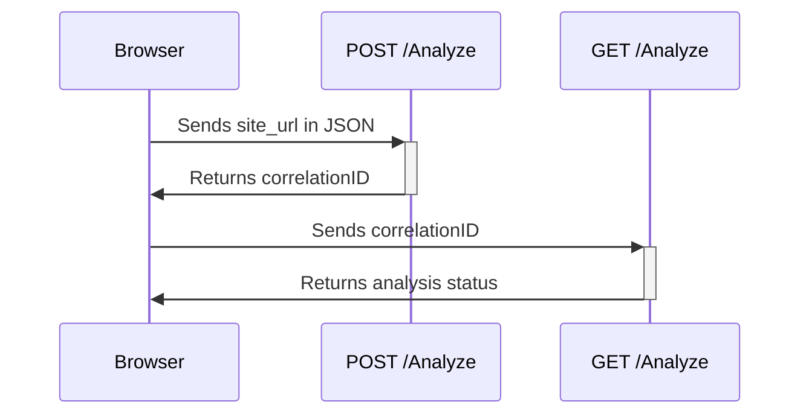

# Html Analyzer

- [Running the App](#running-the-app)
- [Design Decisions](#design-decisions)
- [Build and Deployment](#build-and-deployment)
- [Areas Of Improvement](#areas-of-improvement)
- [Unit and Integration Tests](#unit-and-integration-tests)
- [Curl Commands](#curl-requests)
- [Makefile Commands](#make-commands)

## Running the App
Run `go mod tidy` forllowed by `make run`.  This will lauch the application on port 80 and can be accessed with [http://localhost:80](http://localhost:80) which contains the user interface.

### Intepretting the results
The result comes in json format.  Given below are the json fields and a description of each field

```
{
  // overall result
  "result": {
    // result after analyzing the headings, contains the headings level and the number of headings at each level
    "Heading": {
      "result": { "h1": 0, "h2": 0, "h3": 0, "h4": 0, "h5": 0, "h6": 0 }
    },
    // result of analyzing the links
    "Link": {
      "result": {
        // number of internal links
        "InternalLinks": 6, 
        // number of external links
        "ExternalLinks": 13,
        // number of inaccessible links
        "InaccessibleLinks": null
      }
    },
    // indicates if a login form is available on the page
    "Login": { "result": false },
    // title of the page
    "Title": { "result": "Google" },
    // html version
    "Version": { "result": "HTML5" }
  },
  // overall status of the analysis
  "status": "Complete"
}
```

## Design Decisions

### Architecture

The project employs a simplified version of the **Hexagonal (Ports and Adapters)** architecture. This design choice facilitates a clear separation of concerns by isolating the core logic of the application from external influences and interactions. The core logic can be found in the **domain** folder and the external influences can be found in the **infrastructure** folder of the code.

### Use of Pointers

Pointers are extensively utilized within the codebase. This decision is grounded in the observed performance benefits that pointers offer, particularly in terms of memory efficiency and speed.

### API Endpoints

The project exposes two main API endpoints, designed to streamline the process of submitting and retrieving analysis requests:

1. **Submit Request Endpoint (POST /analyze)**: This endpoint is responsible for accepting requests to analyze web pages. Users can submit the URL of the page they wish to analyze, and the system will initiate the analysis process. Given the potentially time-consuming nature of page analysis, especially for content-rich sites, separating the submission process from result retrieval is crucial. Upon success this will return a **correlationID** which can be used to check the results/status

2. **Get Request Endpoint (GET /analyze)**: This endpoint allows users to retrieve the results of their analysis requests. This separation ensures that users can obtain analysis outcomes without the risk of HTTP connection timeouts, which could occur if page analysis were to take an extended period.



## Build and Deployment

### Building the app

The app is dockerized using a multi-stage build and to build the image simply run the make command `build` found in the makefile.

### Deploying the app

The created image can be deployed on any environment which supports containers for example K8s, ECS or simply EC2 even. Please remember to expose port 80.

You can use the `run-docker` make command to run the docker image on your local box.

## Areas Of Improvement

1. Worker pool: Currently the app uses a go-routines to start off the analysis process. This can be scaled out even more by using worker pools that communicate through channels.

2. Pluggable memory store: The current [SchedulerService](./domain/service/scheduler_service.go) uses an in-memory store to save the results of the analysis. This can be improved by making the the memory store pluggable with something like this

```
type MemoryStore interface{
     func StoreResults(correlationID, results) bool
     func GetResults(correlationID) (results, bool)
}
```

3. Caching: Currently the results are not cached and can be modified to include caching. However special consideration needs to be taken into account when a cached item should be invalidated.

4. Usage of the `Context` package in go: The `context` package in go can be included to

   - Timeout long running analysis
   - Cancel api requests

   This will avoid wastage of server resources.

## Unit and Integration Tests

Unit and integration tests are included in the source code. Running `make test` will run the unit and integration tests. Integration tests are included for `AnalyzeController.go` only. You can find the test data and setup information for these integration tests [here](./infrastructure/adapter/controller/test/). Due to time constraints I have focused mostly on the unit-tests for the domain code.

## Curl requests

Given below are some sample curl requests. Please make sure to modify the url appropriately

Send a request to analyze

`curl -X POST "http://localhost:80/analyze" \
     -H "Content-Type: application/json" \
     -d '{"site_url": "https://www.google.com"}'`

Check the status

`curl "http://localhost:80/analyze?request_id=ad9a2fdf-e43c-42f2-8f3d-cd485e9b907b"`

## Make Commands
There is a [Makefile](./Makefile) which contains useful commands and these are mostly self explanatory.
The following are required to run the makefile and the commands.
1. GNU make
2. golang staticcheck.  You might have to modify the `lint` command on the makefile depending on how your go environment is setup.